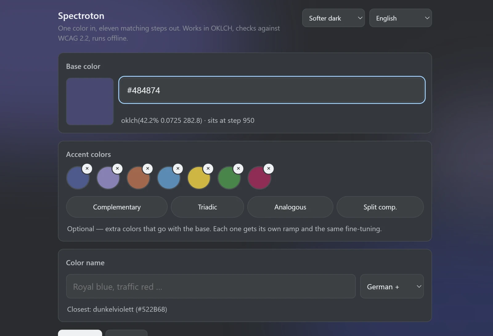
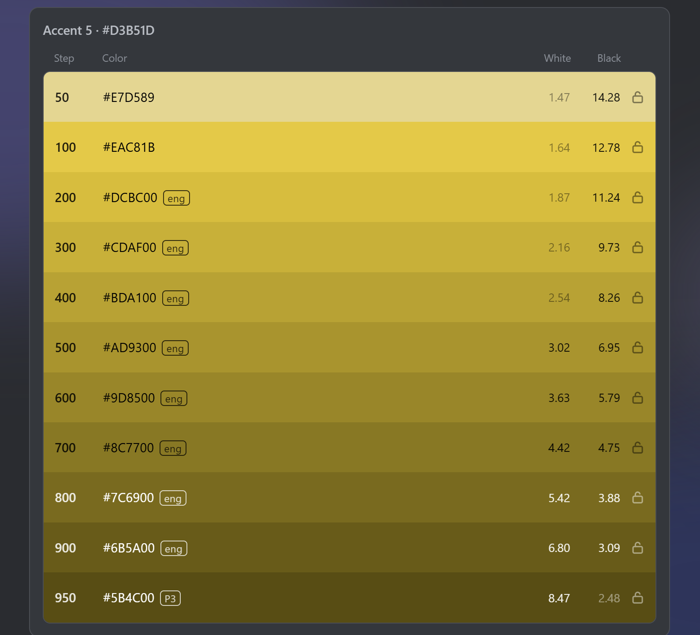
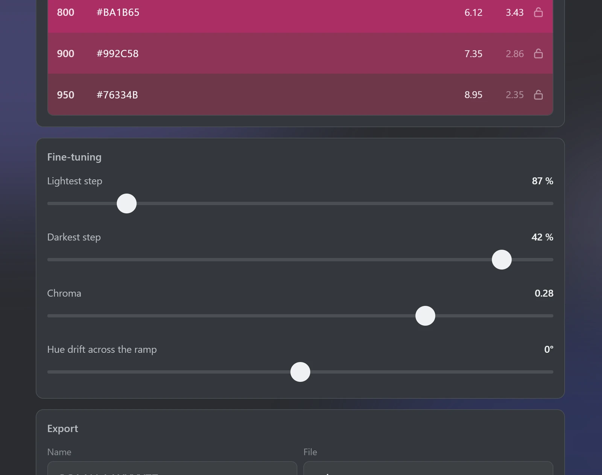
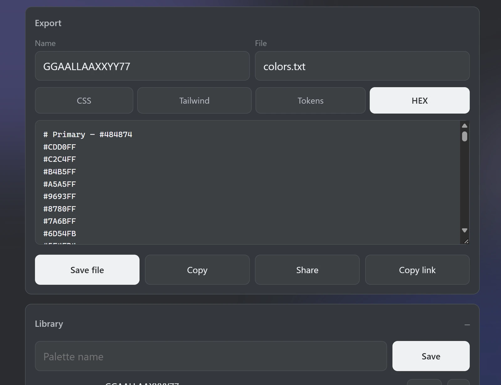

# Spectroton

Eine Farbe rein, elf abgestimmte Stufen raus. Erzeugt perzeptuell gleichmäßige Farbrampen in OKLCH, prüft jede Stufe nach WCAG 2.2 und schreibt das Ergebnis direkt als Datei auf die Platte — offline, ohne Konto, ohne Server.

**Live:** https://dennismit2n.github.io/spectroton/

<table>
<tr>
<td align="center" width="50%">
 
Basisfarbe · Akzentfarben · Farbname
</td>
<td align="center" width="50%">
 
Stufen mit Kontrast und Sperren
</td>
</tr>
<tr>
<td align="center" width="50%">
 
Feinjustage
</td>
<td align="center" width="50%">
 
Export · Bibliothek
</td>
</tr>
</table>

## Features

- Basisfarbe per Picker, HEX-Eingabe oder Namenssuche (deutsche, RAL- und internationale Farbnamen über [color.pizza](https://api.color.pizza))
- Elf Stufen (50–950) in OKLCH, mit Reglern für Helligkeit, Buntheit und Farbdrift
- Akzentfarben per Farbharmonie dazu (komplementär, triadisch, analog, split-komplementär) — jede mit eigener Rampe, gleiche Feinjustage
- WCAG-2.2-Kontrast je Stufe gegen Weiß und Schwarz, wahlweise APCA-Lc-Werte daneben (WCAG-3-Entwurf, nicht normativ)
- Einzelne Stufen sperren — bleiben stehen, wenn Regler oder Basisfarbe sich ändern
- Gamut-Mapping statt hartem Clipping — sRGB- und Display-P3-Warnung
- Export als CSS Custom Properties, Tailwind, DTCG-Tokens oder reine HEX-Liste
- Hintergrund folgt live der gewählten Palette
- Hell, Dunkel, ein weicheres Dunkel oder automatisch nach Systemeinstellung
- Merkt sich Palette und Regler zwischen den Sitzungen; Bibliothek für beliebig viele benannte Paletten — alles im Gerät, kein Konto
- Palette als Link teilen: der komplette Zustand steckt in der URL, kein Server dazwischen
- Installierbar als PWA, läuft komplett offline

## Stack

Eine einzige HTML-Datei, keine Abhängigkeiten, keine Build-Kette. Die Farbmathematik (sRGB ⇄ Oklab ⇄ OKLCH, WCAG-Kontrast, Gamut-Mapping) ist selbst implementiert.

## Zählung

Besuche werden anonym über [GoatCounter](https://www.goatcounter.com/) gezählt — ohne Cookies, ohne Kennung, im Footer offengelegt. Das Zählskript liegt als Kopie in `js/vendor/count.js`; nach draußen geht nur der Zählaufruf. Der geteilte Farbzustand steht im Anker der Adresse (`#p=…`) und wird dabei nie mitgesendet.

## Lizenz

MIT — mit einer Ausnahme: `js/vendor/count.js` ist das Zählskript von GoatCounter und steht unter der ISC-Lizenz (im Dateikopf genannt).
